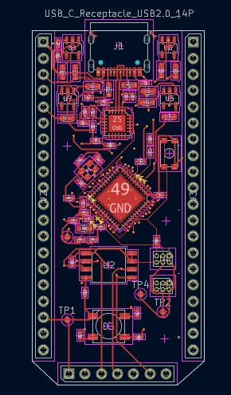
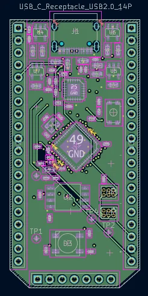
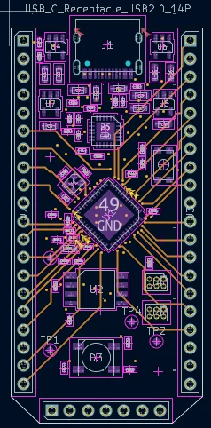
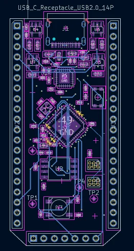

# NorthernStudios iCE40-UltraPlus FPGA Dev Board (V2)

<p align="center">
  
</p>

<p align="center">
  <b>Designed by: Muhammad Uzzam Butt // Made for Macondo</b>
</p>

<p align="center">
  <a href="https://kicad.org">
    
  </a>
  <a href="https://www.oshwa.org/">
    
  </a>
  <a href="LICENSE">
    
  </a>
</p>

---

## 🌟 Overview

The **NorthernStudios iCE40-UltraPlus FPGA Dev Board (V2)** is a compact, open-source development board designed around the **Lattice iCE40 UltraPlus (iCE40UP5K)** FPGA. Engineered specifically for the **Hack Club Macondo** initiative, this board is tailored for low-power edge computing, machine learning (TinyML), RISC-V softcores, and rapid hardware development.

Featuring an onboard USB-to-UART bridge, a high-capacity 128M-bit SPI Flash, and a highly stable multi-rail power system, it offers a complete, unrestricted environment for developers.

---

## 🛠️ Hardware Specifications

### 🧠 Core FPGA: Lattice iCE40UP5K
* **Logic Cells**: 5,280 Look-Up Tables (LUTs)
* **Block RAM (BRAM)**: 120 Kbit
* **Single-Port RAM (SPRAM)**: 1,024 Kbit (128 KB, ideal for microcontroller program memory)
* **DSP Blocks**: 8 (16x16 multiplier + 32-bit accumulator)
* **Hardened IP**: 2x I2C, 2x SPI
* **Constant Current Drivers**: 3x 24mA dedicated driver outputs (suited for RGB LED control)

### 🔌 Key Components
| Component | Function | Description |
| :--- | :--- | :--- |
| **FPGA** | [Lattice iCE40UP5K-SG48ITR](https://www.latticesemi.com/Products/FPGAandCPLD/iCE40UltraPlus) | SG48 package, 48-pin QFN, highly integrated low-power FPGA. |
| **USB-to-UART Bridge** | [Silicon Labs CP2102N](https://www.silabs.com/interface/usb-bridges/usbtouart/device.cp2102n-a02-gqfn24) | High-speed USB-to-UART bridge for programming and serial debugging via USB-C. |
| **SPI Flash** | Winbond W25Q128JVS (128M-bit / 16MB) | Stores FPGA configuration bitstreams and extra user data or filesystem blocks. |
| **Reference Oscillator** | Seiko Epson SG-210STF (12 MHz) | Ultra-precise active crystal oscillator providing a stable system reference clock. |
| **Power Regulators** | Diodes Inc. AP2112K LDOs | Generates +1.2V (Core), +1.8V (PLL/VCC), +2.5V (Auxiliary), and +3.3V (I/O & Flash) from USB +5V. |
| **USB Connector** | USB Type-C Receptacle (14-Pin) | Handles 5V power supply, programming interface, and UART communications. |

---

## 🎛️ Onboard Interfaces & I/O
* **RGB LED**: Dedicated addressable RGB LED (LED_ARGB) connected to the FPGA's constant current outputs for status and visualization.
* **User I/O**: Multi-pin expansion breakout headers featuring standard 0.1" pitch GPIO pins.
* **Tactile Buttons**:
  * Reset Button
  * User Programmable Button

---

## 📐 PCB Design & Layers

This PCB is designed as a high-density, **4-layer board** utilizing KiCad to ensure clean signal routing, stable ground planes, and dedicated power rails. 

### 🔍 Outer Silkscreen & Soldermask
* **Front View (Main Thumbnail)**:
  
* **Back View**:
  

### 🥞 Internal Copper Layer Stackup
* **Layer 1 (L1 - Top Copper / Signals)**:
  
* **Layer 2 (L2 - Inner Ground Plane)**:
  
* **Layer 3 (L3 - Inner Power Plane)**:
  
* **Layer 4 (L4 - Bottom Copper / Signals)**:
  

---

## 📂 Repository Structure

```
├── Models/                     # 3D step models of components
│   └── ICE40UP5K-SG48ITR50.STEP
├── NS FPGA V2 iCE/             # KiCad Project Files
│   ├── NS FPGA V2 iCE.kicad_pro   # KiCad Project File
│   ├── NS FPGA V2 iCE.kicad_sch   # Schematic Sheet
│   └── NS FPGA V2 iCE.kicad_pcb   # PCB Layout
├── src/                        # Graphic assets and layer renders
│   ├── Front SM.webp           # Front Soldermask render
│   ├── Back SM.webp            # Back Soldermask render
│   ├── L1.webp                 # Top Copper Layer render
│   ├── L2.webp                 # Inner Ground Plane render
│   ├── L3.webp                 # Inner Power Plane render
│   └── L4.webp                 # Bottom Copper Layer render
├── .gitignore                  # Gitignore rules for KiCad & system files
├── LICENSE                     # MIT License details
└── README.md                   # Project documentation
```

---

## 🚀 Getting Started

### 💻 Open Source Toolchain Setup
The Lattice iCE40 UltraPlus is fully supported by the open-source FPGA toolchain, providing quick compilation and programming:

1. **Synthesis**: [Yosys](https://github.com/YosysHQ/yosys)
2. **Place & Route**: [nextpnr](https://github.com/YosysHQ/nextpnr) (using target `--up5k`)
3. **Bitstream Packing**: [icepack](https://github.com/YosysHQ/icestorm)
4. **Programming**: [iceprog](https://github.com/YosysHQ/icestorm)

*Note: You can also use Lattice's proprietary IDE **Lattice Radiant** or **iCEcube2**.*

### 🛠️ Cloning the Project
```bash
git clone https://github.com/uzzambutt/NorthernStudios-iCE40-UltraPlus-FPGA-Dev-Board.git
```

---

## 📜 License

This project is licensed under the **MIT License**. For details, see the [LICENSE](LICENSE) file.
